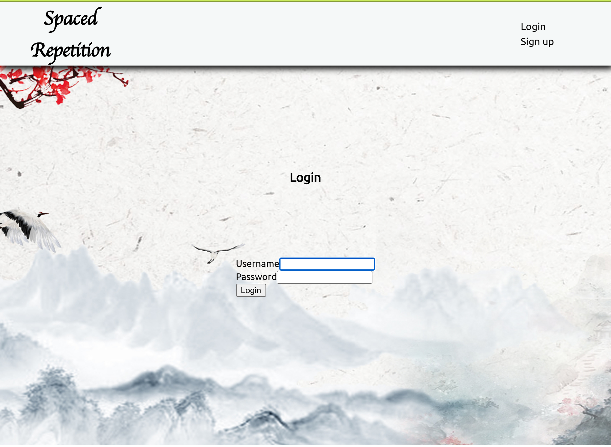
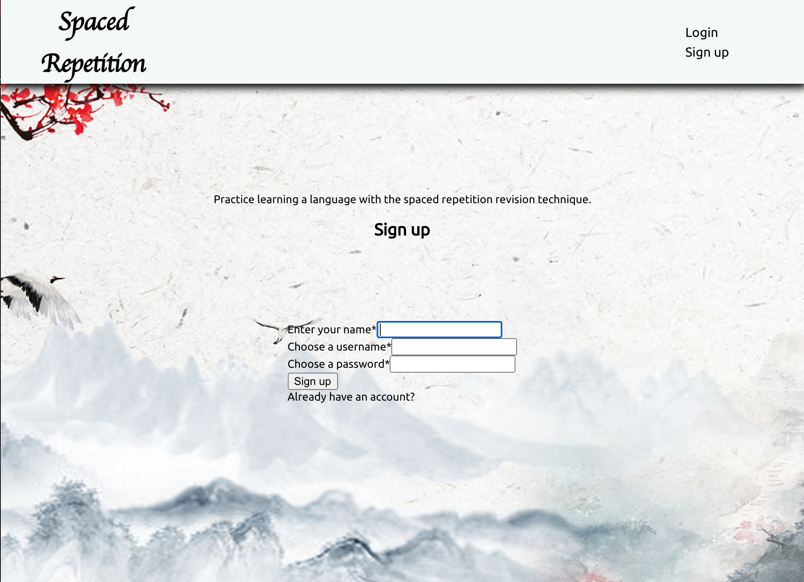
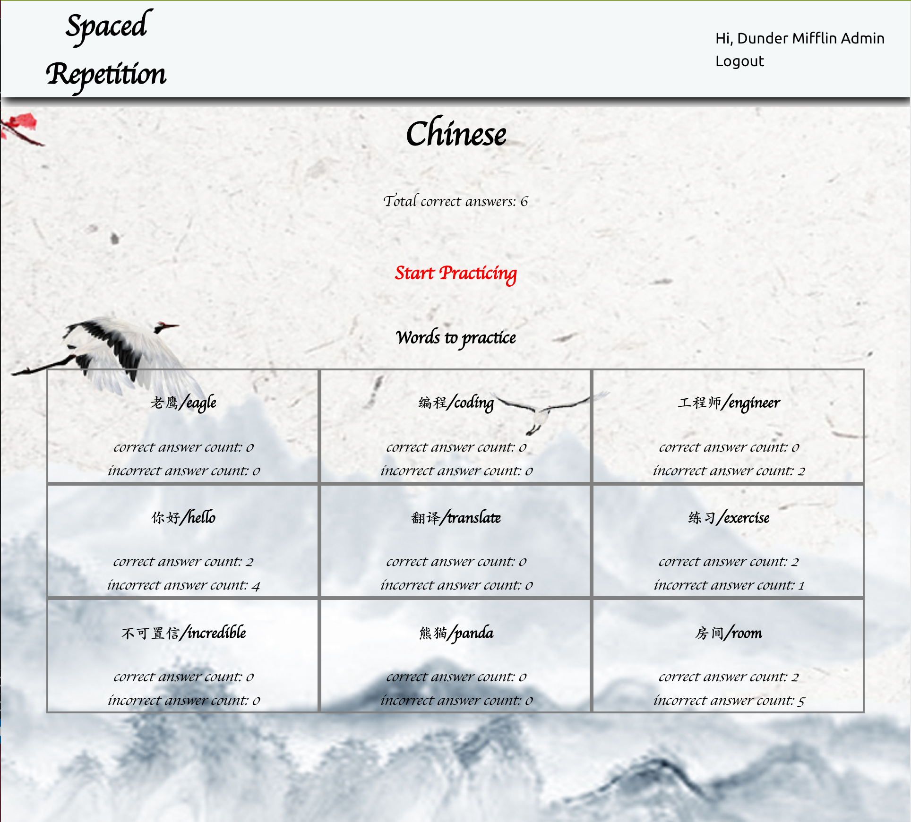
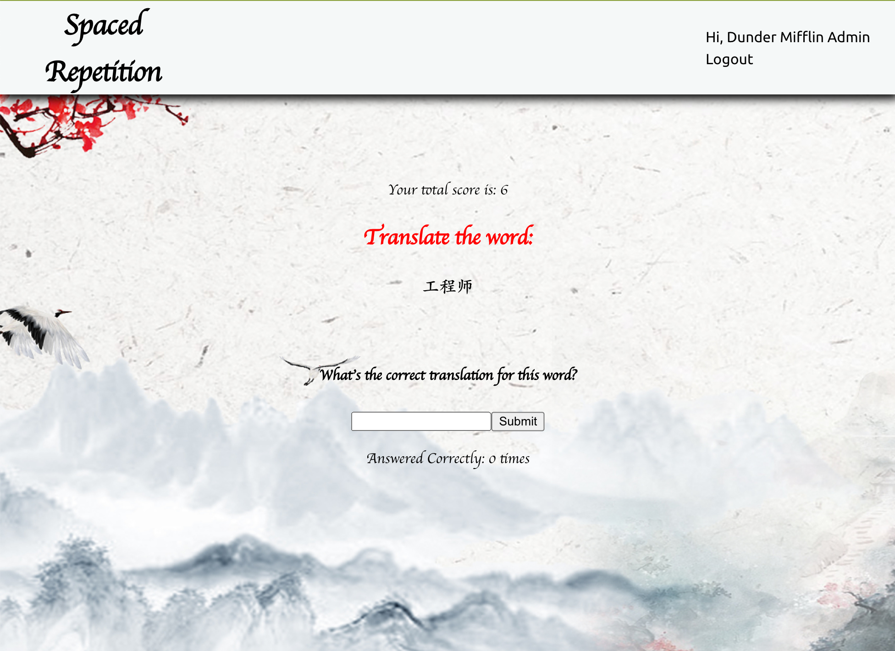
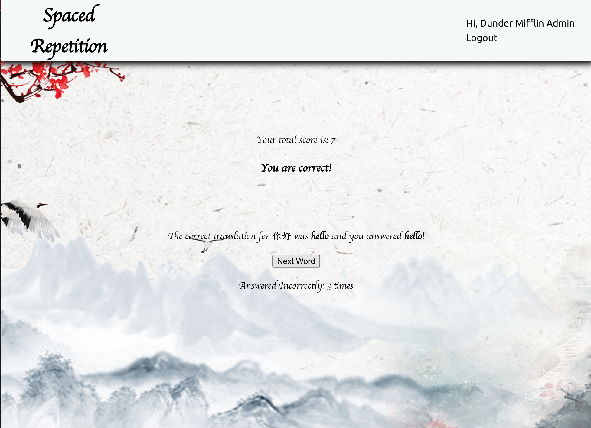
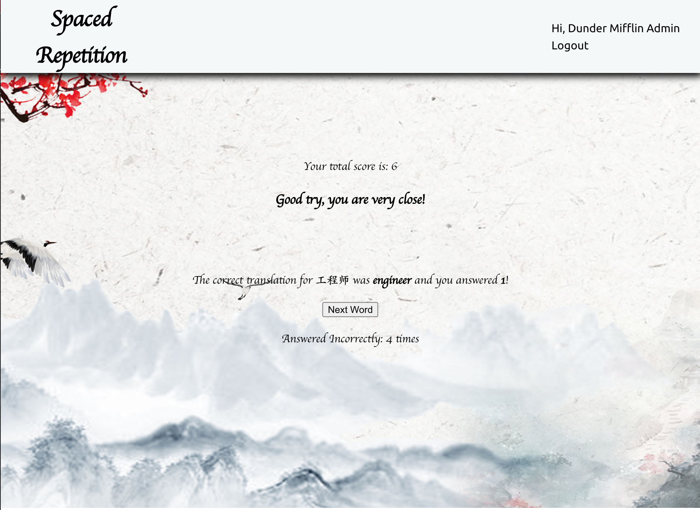

# Spaced Repetition

* Live App: https://spaced-repetition-lime-two.vercel.app/register
* Database URL: https://stark-temple-37903.herokuapp.com/api
* Client Repo: https://github.com/uimm258/Spaced-Repetition-Client
* Server Repo: https://github.com/uimm258/Spaced-Repetition-api

An application for learning Chinese words using spaced repetition as the quizzing method. Implements a linked list and sorting algorithm. Deme user: username:admin, password:pass.

# Stack Used

* Client: HTML, CSS, React.Js
* Server: Express and Node.Js

# Description
Try learning Chinese words using this application that makes use of the spaced repetition method! You'll need to create an account to start learning. When you log in, you'll be shown your dashboard, which will contain the words to learn, correct and incorrect counts for the word, and a total score. Click 'Start practicing' to start learning.

On the learning page, you can guess the english translation of the word and receive feedback. You can also see your total score and the correct and incorrect counts for the word you're viewing. The next word you are quizzed on is given based on whether your guess for it was correct or incorrect. If you guess incorrectly, you'll be quizzed on it again in two turns. Guessing a particular word correctly consecutively, sends the word further down the line, so you'll see it less often (depending on how you do on the other words).

# Screenshots
* Login-Page

* SignUp-Page

* Dashboard

* Learning-Page

* Correct-Page

* Incorrect-Page

